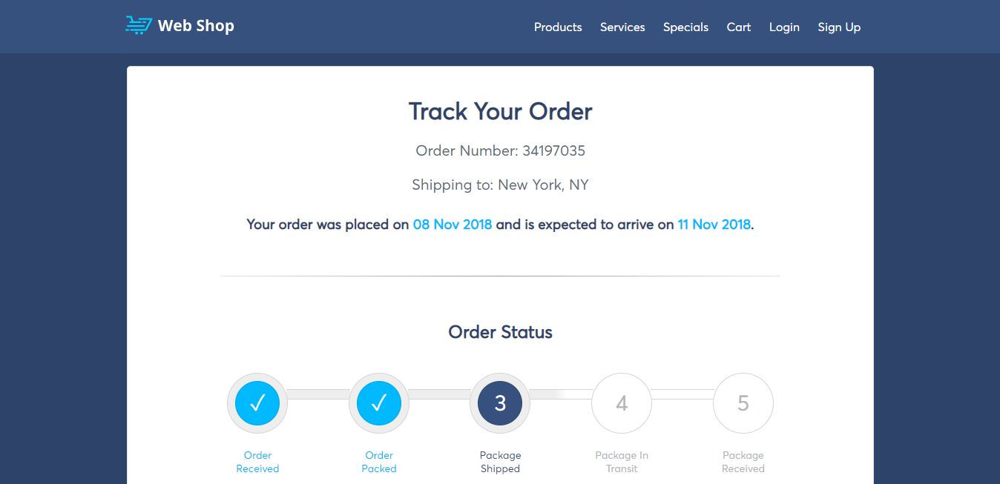

<p align="center">
  
</p>
<p align="center">
  <a href="#">
    
  </a>
  <a href="#">
    
  </a>
  <a href="#">
    <image alt="Built with Moment.js" src="https://img.shields.io/badge/built%20with-moment.js-green.svg" />
  </a>
</p>
<hr>
<h1 align="center">Order Tracker</h1>
<h4 align="center">Order Tracker is a vanilla JavaScript web component for tracking orders.</h4>
<h3 align="center"><a href="http://projects.jsrath.com/order-tracker">LIVE SITE</a></h3>

Order tracker features an interactive progress bar and countdown timer to give users an accurate estimate of when they will receive their order.

This is a frontend component which can be triggered by order progress events in a database or CMS.

## Installation

```sh
git clone https://github.com/jsrath/order-tracker.git
```

## Setup

1. Change the IIFE `countdown(moment().add(3, 'd'))` to suit the actual time remaining.

2. Change `document.querySelector('.expectedDate').innerText = moment().add(3, 'd')` to suit the actual time remaining.

## License

> The MIT License (MIT)<br/> Copyright © 2018 JS Rath <br/> Permission is hereby granted, free of charge, to any person obtaining a copy of this software and associated documentation files (the “Software”), to deal in the Software without restriction, including without limitation the rights to use, copy, modify, merge, publish, distribute, sublicense, and/or sell copies of the Software, and to permit persons to whom the Software is furnished to do so, subject to the following conditions: <br/>The above copyright notice and this permission notice shall be included in all copies or substantial portions of the Software. <br/> THE SOFTWARE IS PROVIDED “AS IS”, WITHOUT WARRANTY OF ANY KIND, EXPRESS OR IMPLIED, INCLUDING BUT NOT LIMITED TO THE WARRANTIES OF MERCHANTABILITY, FITNESS FOR A PARTICULAR PURPOSE AND NONINFRINGEMENT. IN NO EVENT SHALL THE AUTHORS OR COPYRIGHT HOLDERS BE LIABLE FOR ANY CLAIM, DAMAGES OR OTHER LIABILITY, WHETHER IN AN ACTION OF CONTRACT, TORT OR OTHERWISE, ARISING FROM, OUT OF OR IN CONNECTION WITH THE SOFTWARE OR THE USE OR OTHER DEALINGS IN THE SOFTWARE.

---

Created and maintained by [JS Rath](http://www.jsrath.com).
